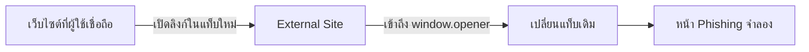

# EP01 — Reverse Tabnabbing


> **แท็บเดิมถูกเปลี่ยนตอนไหน?**

ลองนึกภาพว่าคุณเปิดลิงก์จากเว็บไซต์ที่เชื่อถือได้ไปอ่านข้อมูลในแท็บใหม่ เมื่อกลับมายังแท็บเดิม หน้าเว็บกลับแจ้งว่า Session หมดอายุและขอให้ Login อีกครั้ง

ถ้าหน้านั้นไม่ใช่เว็บไซต์เดิม แต่เป็นหน้า Phishing ที่ถูกสับเปลี่ยนเข้ามา คุณจะสังเกตทันหรือไม่?

Lab นี้จะพาโจมตี ทำความเข้าใจ ป้องกัน และทดสอบซ้ำแบบ Red Team, Blue Team และ Purple Team

> **Attack → Understand → Defend → Retest**

## Reverse Tabnabbing คืออะไร

Reverse Tabnabbing เกิดขึ้นเมื่อหน้าเว็บที่เปิดในแท็บใหม่สามารถอ้างอิงกลับไปยังแท็บต้นทางผ่าน `window.opener` และสั่งให้แท็บเดิมเปลี่ยนไปยัง URL อื่น เช่น หน้า Login ปลอม



Browser รุ่นใหม่จำนวนมากป้องกันลิงก์ `target="_blank"` โดยอัตโนมัติแล้ว Lab นี้จึงระบุ `rel="opener"` อย่างชัดเจนเพื่อจำลองพฤติกรรมที่ไม่ปลอดภัยให้เห็นได้สม่ำเสมอ

## สิ่งที่จะได้เรียนรู้

- ความสัมพันธ์ระหว่าง `target="_blank"` และ `window.opener`
- วิธีค้นหาและพิสูจน์ช่องโหว่แบบ Red Team
- วิธีวิเคราะห์ Root Cause และผลกระทบ
- วิธีแก้ไขและเพิ่ม Guardrail แบบ Blue Team
- วิธี Retest และปิด Finding แบบ Purple Team

## เตรียม Lab

```bash
cd 01-reverse-tabnabbing/demo
python -m http.server 8000
```

จากนั้นเปิด <http://localhost:8000>

> ควรรันผ่าน Web Server แทนการเปิดด้วย `file://` เพราะ Browser อาจจัดการ Origin และ Permission แตกต่างกัน

## 1. Attack — Red Team

### Reconnaissance

ค้นหาลิงก์ที่เปิดแท็บใหม่

```bash
rg -n 'target="_blank"' .
```

ตรวจว่าลิงก์มี `noopener` หรือไม่ ปลายทางอยู่ภายใต้การควบคุมของใคร และหน้าต้นทางเกี่ยวข้องกับ Login หรือข้อมูลสำคัญหรือไม่

### Proof of Concept

1. เลือก **ทดลองแบบ Vulnerable**
2. เปิด External Site ในแท็บใหม่
3. ยืนยันว่าหน้าใหม่แสดง **พบ window.opener**
4. กด **จำลอง Reverse Tabnabbing**
5. กลับไปดูแท็บเดิม ซึ่งจะถูกเปลี่ยนเป็นหน้า Phishing จำลอง

โค้ดที่จำลองพฤติกรรมไม่ปลอดภัย:

```html
<a href="attacker.html" target="_blank" rel="opener">
  เปิด External Site
</a>
```

ตรวจใน DevTools Console:

```js
Boolean(window.opener)
```

ผลที่คาดหวังในหน้า Vulnerable คือ `true`

PoC ของ Lab จะเปลี่ยนหน้าเท่าที่จำเป็นและไม่รับหรือบันทึก Credential ใด ๆ

## 2. Understand — Root Cause

เมื่อหน้าใหม่ได้รับ `window.opener` จะสามารถสั่ง Navigation ของแท็บต้นทางได้

```js
if (window.opener && !window.opener.closed) {
  window.opener.location.href = "phishing.html";
}
```

ผู้ใช้อาจไม่เห็นขณะที่แท็บเดิมถูกเปลี่ยน และอาจเชื่อว่าหน้า Login จำลองคือเว็บไซต์เดิมที่ Session หมดอายุ

ความเสี่ยงจะสูงขึ้นเมื่อหน้าต้นทางเกี่ยวข้องกับ Account หรือ Admin และ URL ปลายทางอยู่นอกการควบคุมขององค์กร

## 3. Defend — Blue Team

เพิ่ม `noopener noreferrer` เพื่อตัดการอ้างอิงกลับไปยังแท็บต้นทาง

```html
<a href="attacker.html" target="_blank" rel="noopener noreferrer">
  เปิด External Site อย่างปลอดภัย
</a>
```

- `noopener` ทำให้หน้าใหม่ไม่ได้รับ `window.opener`
- `noreferrer` ไม่ส่งค่า `Referer` และมีผลคล้าย `noopener` ใน Browser ที่รองรับ
- ควรค้นหา Pattern เดียวกันทั้ง Codebase ไม่แก้เฉพาะจุดที่พบ
- Frontend ขนาดใหญ่ควรใช้ Shared External Link Component และ Linter Rule

## 4. Retest — Purple Team

1. เปิดหน้า **Safe**
2. เปิด External Site ในแท็บใหม่
3. ยืนยันว่าหน้าแสดง **ไม่พบ window.opener**
4. ยืนยันว่าปุ่มโจมตีถูกปิดใช้งาน
5. ยืนยันว่าแท็บต้นทางไม่เปลี่ยน URL

เงื่อนไขผ่าน Lab:

```text
Boolean(window.opener) === false
แท็บต้นทางไม่เปลี่ยนเมื่อใช้ PoC เดิม
Regression Test ผ่าน
```

## ฝึกตามบทบาท

| บทบาท | เป้าหมาย | คู่มือ |
| --- | --- | --- |
| Red Team | กำหนดขอบเขต ค้นหาจุดเสี่ยง สร้าง PoC เก็บหลักฐาน และเขียน Finding | [Red Team Playbook](./docs/RED_TEAM.md) |
| Blue Team | ตรวจสอบ Finding, Scope ระบบ, แก้ไข เพิ่ม Guardrail และ Regression Test | [Blue Team Playbook](./docs/BLUE_TEAM.md) |
| Purple Team | ใช้ PoC เดิม Retest และสรุป Detection Gap ร่วมกัน | ใช้ Checklist จากทั้งสอง Playbook |

## ข้อควรระวัง

> [!WARNING]
> ใช้ Lab นี้กับ `localhost` หรือระบบที่ได้รับอนุญาตเท่านั้น

- ห้ามทดลองกับเว็บไซต์หรือบุคคลอื่น
- ห้ามใช้หรือเก็บ Credential จริง
- ห้ามเผยแพร่หน้า Phishing สู่ Public Internet
- หยุดการทดสอบทันทีเมื่อออกนอกขอบเขตที่กำหนด

## โครงสร้างไฟล์

```text
01-reverse-tabnabbing/
├── README.md
├── assets/
│   └── ep01-reverse-tabnabbing-cover.png
├── docs/
│   ├── RED_TEAM.md
│   └── BLUE_TEAM.md
└── demo/
    ├── index.html
    ├── vulnerable.html
    ├── safe.html
    ├── attacker.html
    ├── phishing.html
    ├── attacker.js
    └── styles.css
```

[กลับไปหน้าหลัก](../README.md)
