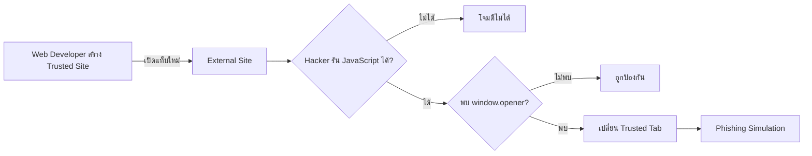

# EP01 — Reverse Tabnabbing


> **Build → Discover → Attack → Defend → Retest**

EP นี้จำลองสถานการณ์จริงด้วยเว็บไซต์สอง Origin

| Site | URL | บทบาท |
| --- | --- | --- |
| Trusted Site | `localhost:8000/trusted-site/` | Web Developer สร้างและ Blue Team แก้ไข |
| External Site | `localhost:9000/external-site/` | Partner Site ที่ Red Team จำลองการควบคุม |

## เงื่อนไขสำคัญของการโจมตี

Hacker ไม่สามารถโจมตีได้เพียงเพราะพบ External Link แต่ต้องมีความสามารถรัน JavaScript บน External Site ก่อน เช่น

- Hacker เป็นเจ้าของ External Site
- External Site ถูก Compromise
- Domain ปลายทางถูก Takeover
- External Site มีช่องโหว่ที่ทำให้รัน JavaScript ได้

จากนั้น Hacker จึงตรวจจากฝั่ง External Site ว่า `window.opener` อ้างอิงกลับไปยัง Trusted Site ได้หรือไม่



## Flow ของคลิป

| Part | บทบาท | สิ่งที่จะเขียน | คู่มือ |
| --- | --- | --- | --- |
| 1 | Web Developer | `trusted-site/index.html` และ External Link | [Web Developer](./docs/WEB_DEVELOPER.md) |
| 2 | Red Team | `external-site/index.html`, JavaScript Payload และ `phishing.html` | [Red Team](./docs/RED_TEAM.md) |
| 3 | Blue Team | แก้ Trusted Link และเพิ่ม Guardrail/Regression Test | [Blue Team](./docs/BLUE_TEAM.md) |

## โครงสร้าง Lab

```text
demo/
├── trusted-site/
│   └── index.html       # Web Developer / Blue Team
├── external-site/
│   ├── index.html       # Red Team
│   └── phishing.html    # Red Team
└── style.css            # ใช้ร่วมกันและไม่บังคับ
```

## เริ่ม Lab

เปิด Terminal สองหน้า โดยรันจากโฟลเดอร์ `demo` ทั้งคู่

Terminal 1 — Trusted Site:

```bash
python -m http.server 8000
```

Terminal 2 — External Site:

```bash
python -m http.server 9000
```

เปิด <http://localhost:8000/trusted-site/>

## Part 1 — Web Developer

Developer เขียนลิงก์ไปยัง External Site จริงคนละ Origin

```html
<a href="http://localhost:9000/external-site/"
   target="_blank"
   rel="opener">
  เปิดบทความในแท็บใหม่
</a>
```

Lab ใช้ `rel="opener"` เพื่อจำลองพฤติกรรมไม่ปลอดภัยอย่างชัดเจน เพราะ Browser รุ่นใหม่จำนวนมากป้องกัน `_blank` โดยอัตโนมัติแล้ว

[สร้าง Trusted Site ทีละขั้น](./docs/WEB_DEVELOPER.md)

## Part 2 — Red Team

Red Team จำลองการควบคุม External Site แล้วตรวจใน Console

```js
Boolean(window.opener)
```

เมื่อผลเป็น `true` จึงเพิ่ม Payload บน External Site

```js
const phishingUrl = new URL("phishing.html", location.href);
window.opener.location.href = phishingUrl.href;
```

Trusted Tab จะเปลี่ยนจาก Port `8000` ไปยังหน้า Phishing จำลองบน Port `9000`

[ตรวจช่องโหว่และสร้าง PoC ทีละไฟล์](./docs/RED_TEAM.md)

## Part 3 — Blue Team

Blue Team กลับไปแก้ Code ของ Trusted Site

```html
<a href="http://localhost:9000/external-site/"
   target="_blank"
   rel="noopener noreferrer">
  เปิดบทความในแท็บใหม่
</a>
```

จากนั้นใช้ External Site และ Payload เดิม Retest

```text
PASS เมื่อ
Boolean(window.opener) === false
Trusted Tab ยังคงอยู่บน Port 8000
```

[แก้ไขและ Retest ทีละขั้น](./docs/BLUE_TEAM.md)

## Guardrail ของ Lab

- ใช้เฉพาะ `localhost`
- ใช้ข้อมูลสมมติเท่านั้น
- ไม่มี `fetch`, Backend, Database หรือ Storage
- External Site แสดง Debug Panel เพื่อการเรียนรู้
- ห้ามเผยแพร่ Lab สู่ Public Internet

[กลับไปหน้าหลัก](../README.md)
