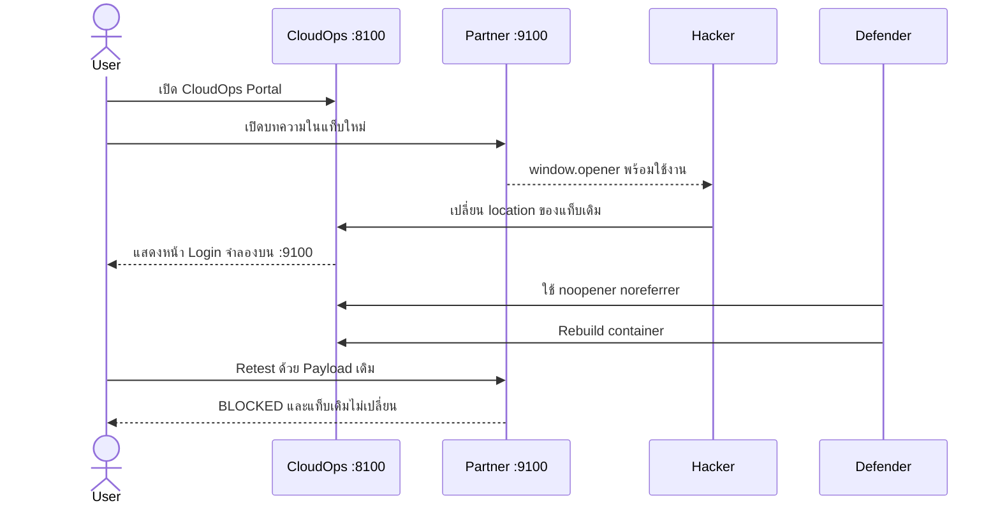

# EP1.1 — Reverse Tabnabbing: Hacker vs Defender on Podman

> **Deploy → Attack → Investigate → Defend → Rebuild → Retest**

ตอนพิเศษต่อจาก EP1 โดยตัดช่วงสร้างหน้าเว็บทีละบรรทัดออก ผู้ชมจะเริ่มจากเว็บไซต์สมมติที่ดูพร้อมใช้งานและ Deploy อยู่ใน Podman แล้ว จากนั้นติดตามเหตุการณ์ผ่านสองบทบาทคือ **Hacker** และ **Defender**

> [!WARNING]
> Lab นี้ใช้เพื่อการศึกษาและทดสอบระบบที่ได้รับอนุญาตเท่านั้น ทุก Service bind กับ `127.0.0.1` หน้า Phishing ไม่ส่ง Request และไม่บันทึกข้อมูล ห้ามนำระบบที่มีช่องโหว่ออกสู่ Public Internet

## ความสัมพันธ์กับ EP1

| EP1 | EP1.1 |
| --- | --- |
| สร้าง HTML และทำความเข้าใจพื้นฐาน | เริ่มจากระบบที่ Deploy และพร้อมทดสอบ |
| ใช้ `python -m http.server` | ใช้สอง Container บน Podman |
| Developer → Red Team → Blue Team | Hacker → Defender → Retest |
| หน้าตาเรียบง่ายเพื่อดู Code | เว็บสมจริงเพื่อเล่าเหตุการณ์ให้เห็นภาพ |

EP1.1 ไม่แทนที่ EP1 แต่เป็นสถานการณ์ต่อยอดสำหรับผู้ชมที่เข้าใจ `target="_blank"`, `window.opener` และ Same-origin Policy จากตอนแรกแล้ว

## Scenario

KOPE CloudOps Portal แนะนำบทความจาก Orbit Security Labs ซึ่งเป็น Partner ภายนอก ลิงก์เปิดแท็บใหม่ด้วย `rel="opener"` หากเว็บ Partner ถูกยึด ผู้โจมตีสามารถใช้ `window.opener` เปลี่ยนหน้า Portal เดิมให้เป็นหน้า Login ปลอมได้



## Architecture

| Service | URL | Container | หน้าที่ |
| --- | --- | --- | --- |
| Trusted Site | <http://localhost:8100> | `kope-ep01-1-trusted` | หน้า Login จริงและ CloudOps Portal ที่มีช่องโหว่ |
| External Site | <http://localhost:9100> | `kope-ep01-1-external` | Partner Site, Hacker Console และ Payload |

ทั้งสองเว็บใช้ Nginx คนละ Container และคนละ Origin โดย publish port เฉพาะ `127.0.0.1`

## สิ่งที่ต้องมี

- Podman
- Compose provider เช่น `podman-compose`
- Browser ที่เปิด DevTools ได้

โปรเจกต์นี้ใช้ `compose.yaml` ตาม Compose Specification และใช้ `podman compose` เป็นคำสั่งหลัก ส่วน Provider เป็นรายละเอียดภายในที่ Podman เรียกให้อัตโนมัติ

### ตั้งค่า Provider บน Linux / WSL

ตรวจสอบก่อนว่า `podman-compose` พร้อมใช้งาน:

```bash
podman --version
podman-compose version
```

กำหนดให้ `podman compose` ใช้ Provider จาก Linux แทน `docker-compose.exe` ของ Windows:

```bash
export PODMAN_COMPOSE_PROVIDER="$(command -v podman-compose)"
```

หากต้องการให้มีผลทุกครั้งที่เปิด Terminal:

```bash
echo 'export PODMAN_COMPOSE_PROVIDER="$(command -v podman-compose)"' >> ~/.bashrc
source ~/.bashrc
```

จากนั้นตรวจสอบคำสั่งมาตรฐาน:

```bash
podman compose version
```

> [!NOTE]
> ถ้า `podman compose version` แสดง path ใต้ `/mnt/c/Program Files/Docker/` แปลว่า Podman เลือก Docker Compose จาก Windows ผิดตัว ให้ตั้ง `PODMAN_COMPOSE_PROVIDER` ตามขั้นตอนด้านบน
## เริ่ม Lab

จากโฟลเดอร์นี้ให้รัน:

```bash
podman compose up -d --build
podman compose ps
```

เปิด <http://localhost:8100> ยืนยันว่าเห็นหน้า **Sign in — KOPE CloudOps** จากนั้นกรอกข้อมูลสมมติและเข้าสู่หน้า Portal

## Part 1 — Hacker

รายละเอียด: [HACKER.md](./docs/HACKER.md)

1. เปิดหน้า Login จริงที่ Port 8100 และจดจำ URL/หน้าตา
2. ใช้ข้อมูลสมมติเข้าสู่ CloudOps Portal
3. กด **อ่านบทความจาก Partner** เพื่อเปิด Port 9100 ในแท็บใหม่
4. Hacker Console จะแสดง EXPOSED เพราะพบ window.opener
5. รอ 5 วินาที แล้วกลับไปแท็บเดิม
6. แท็บเดิมถูกเปลี่ยนเป็น /session-expired.html บน Port 9100
7. เปรียบเทียบหน้า Login ปลอมกับหน้า Login จริง โดยให้ความสำคัญกับ Address Bar

## จุดสังเกตหน้า Login จริงกับหน้าปลอม

| สิ่งที่สังเกต | Login จริง | Login ปลอม |
| --- | --- | --- |
| URL / Origin | http://localhost:8100 | http://localhost:9100 |
| จังหวะที่ปรากฏ | ผู้ใช้เปิดและเข้าสู่ระบบเอง | โผล่แทนแท็บเดิมหลังเปิดเว็บ Partner |
| ข้อความ | เข้าสู่ระบบตามปกติ | อ้างว่า Session หมดอายุและขอให้กรอกซ้ำ |
| หน้าตา | สี โลโก้ และ Layout ของจริง | เลียนแบบได้เกือบทั้งหมด |

**URL/Origin เป็นหลักฐานสำคัญที่สุดใน Lab นี้** ส่วนสี โลโก้ ข้อความ และ Layout สามารถถูกคัดลอกได้ ในระบบจริงควรตรวจ Domain, HTTPS/Certificate และใช้ Password Manager ซึ่งจะผูก Credential กับ Origin เดิม
หลักฐานที่ควรถ่ายในคลิป:

- URL ของทั้งสองแท็บก่อนโจมตี
- สถานะ `EXPOSED` ใน Hacker Console
- URL ของแท็บเดิมหลัง Payload ทำงาน
- Source ของลิงก์ที่มี `rel="opener"`

## Part 2 — Defender

รายละเอียด: [DEFENDER.md](./docs/DEFENDER.md)

แก้ไฟล์ `demo/trusted-site/portal.html` จาก:

```html
target="_blank" rel="opener"
```

เป็น:

```html
target="_blank" rel="noopener noreferrer"
```

จากนั้น rebuild เฉพาะ Trusted Site:

```bash
podman compose up -d --build trusted-site
```

การแก้ไฟล์บน Host อย่างเดียวยังไม่เปลี่ยน Container ที่รันอยู่ เพราะ Source ถูก `COPY` เข้า Image ในขั้นตอน build จุดนี้เป็นบทเรียนสำคัญของตอนพิเศษ

## Part 3 — Retest

1. ปิดแท็บ External Site เดิมเพื่อไม่ใช้ `window.opener` เก่า
2. Hard reload หน้า Trusted Site
3. เปิดบทความจาก Partner อีกครั้ง
4. Hacker Console ต้องแสดง `BLOCKED`
5. รอเกิน 5 วินาทีและยืนยันว่า Trusted Tab ยังอยู่ที่ Port `8100`

### Closure criteria

```text
External Site: Boolean(window.opener) === false
Hacker Console: BLOCKED
Trusted Tab: ยังคงอยู่ที่ http://localhost:8100
Payload เดิม: ไม่สามารถเปลี่ยน Trusted Tab ได้
```

## หยุด Lab

```bash
podman compose down
```

คำสั่งนี้หยุดและลบ Container/Network ของ Lab แต่ยังเก็บ Image ไว้เพื่อเปิดใช้งานครั้งต่อไปได้รวดเร็ว

## โครงสร้างไฟล์

```text
01.1-reverse-tabnabbing-podman/
├── Containerfile
├── compose.yaml
├── README.md
├── docs/
│   ├── HACKER.md
│   └── DEFENDER.md
└── demo/
    ├── common/style.css
    ├── trusted-site/
    │   ├── index.html       # หน้า Login จริง
    │   └── portal.html      # Dashboard และลิงก์ที่มีช่องโหว่
    └── external-site/
        ├── index.html
        └── session-expired.html
```

## ขอบเขตและข้อจำกัด

- Lab จงใจใช้ `rel="opener"` เพื่อให้ผลเหมือนกันบน Browser รุ่นใหม่หลายรุ่น
- Same-origin Policy ป้องกัน Hacker อ่าน DOM ของ Trusted Site แต่ไม่ได้ป้องกันการกำหนด `window.opener.location`
- หน้า Login เป็น Simulation เท่านั้น ไม่มี Backend, `fetch`, Database, Cookie หรือ Storage
- ใช้ Credential สมมติเท่านั้น
- ไม่ควรเปลี่ยน port binding จาก `127.0.0.1` เป็น `0.0.0.0`

[กลับไปหน้า Playlist](../README.md)
