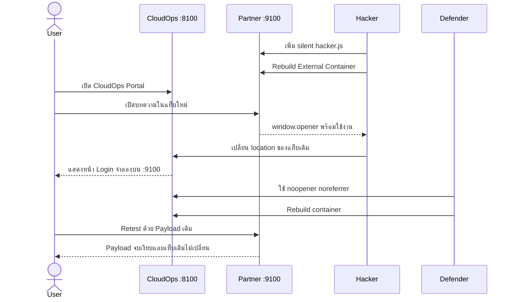

# EP1.1 — Reverse Tabnabbing: Hacker vs Defender on Podman

> **Deploy → Attack → Investigate → Defend → Rebuild → Retest**

ตอนพิเศษต่อจาก EP1 โดยตัดช่วงสร้างหน้าเว็บทีละบรรทัดออก ผู้ชมจะเริ่มจากเว็บไซต์สมมติที่ดูพร้อมใช้งานและ Deploy อยู่ใน Podman แล้ว จากนั้นติดตามเหตุการณ์ผ่านสองบทบาทคือ **Hacker** และ **Defender**

> [!WARNING]
> Lab นี้ใช้เพื่อการศึกษาและทดสอบระบบที่ได้รับอนุญาตเท่านั้น ทุก Service bind กับ `127.0.0.1` หน้า Phishing ไม่ส่ง Request และไม่บันทึกข้อมูล ห้ามนำระบบที่มีช่องโหว่ออกสู่ Public Internet

## ความสัมพันธ์กับ EP1

| EP1 | EP1.1 |
| --- | --- |
| สร้าง HTML และทำความเข้าใจพื้นฐาน | เริ่มจากระบบที่ Deploy และพร้อมทดสอบ |
| ใช้ `python -m http.server` | ใช้สอง Container บน Podman |
| Developer → Red Team → Blue Team | Hacker → Defender → Retest |
| หน้าตาเรียบง่ายเพื่อดู Code | เว็บสมจริงเพื่อเล่าเหตุการณ์ให้เห็นภาพ |

EP1.1 ไม่แทนที่ EP1 แต่เป็นสถานการณ์ต่อยอดสำหรับผู้ชมที่เข้าใจ `target="_blank"`, `window.opener` และ Same-origin Policy จากตอนแรกแล้ว

## Scenario

KOPE CloudOps Portal แนะนำบทความจาก Orbit Security Labs ซึ่งเริ่มต้นเป็น Partner Site ปกติ จากนั้น Hacker จำลองการเข้าควบคุม Source, เพิ่ม JavaScript Payload แบบเงียบและ rebuild External Site เมื่อลิงก์จาก Portal เปิดแท็บใหม่ด้วย `rel="opener"` เว็บไซต์ที่ถูกแก้ไขจึงใช้ `window.opener` เปลี่ยนหน้า Portal เดิมให้เป็นหน้า Login ปลอมได้



## Architecture

| Service | URL | Compose service | หน้าที่ |
| --- | --- | --- | --- |
| Trusted Site | <http://localhost:8100> | `trusted-site` | หน้า Login จริงและ CloudOps Portal ที่มีช่องโหว่ |
| External Site | <http://localhost:9100> | `external-site` | เริ่มจาก Partner Site ปกติ แล้ว Hacker เพิ่ม Payload แบบไม่แสดง UI |

ทั้งสองเว็บใช้ Nginx คนละ Container และคนละ Origin โดย publish port เฉพาะ `127.0.0.1`

## สิ่งที่ต้องมี

- Podman
- Compose provider เช่น `podman-compose`
- Browser ที่เปิด DevTools ได้

โปรเจกต์นี้ใช้ `compose.yaml` ตาม Compose Specification และใช้ `podman compose` เป็นคำสั่งหลัก ส่วน Provider เป็นรายละเอียดภายในที่ Podman เรียกให้อัตโนมัติ

### ตั้งค่า Provider บน Linux / WSL

ตรวจสอบก่อนว่า `podman-compose` พร้อมใช้งาน:

```bash
podman --version
podman-compose version
```

กำหนดให้ `podman compose` ใช้ Provider จาก Linux แทน `docker-compose.exe` ของ Windows:

```bash
export PODMAN_COMPOSE_PROVIDER="$(command -v podman-compose)"
```

หากต้องการให้มีผลทุกครั้งที่เปิด Terminal:

```bash
echo 'export PODMAN_COMPOSE_PROVIDER="$(command -v podman-compose)"' >> ~/.bashrc
source ~/.bashrc
```

จากนั้นตรวจสอบคำสั่งมาตรฐาน:

```bash
podman compose version
```

> [!NOTE]
> ถ้า `podman compose version` แสดง path ใต้ `/mnt/c/Program Files/Docker/` แปลว่า Podman เลือก Docker Compose จาก Windows ผิดตัว ให้ตั้ง `PODMAN_COMPOSE_PROVIDER` ตามขั้นตอนด้านบน

## แก้ปัญหา Container ชื่อซ้ำหรือ Port ถูกใช้งาน

โปรเจกต์รุ่นปัจจุบันไม่กำหนด `container_name` แบบตายตัวแล้ว Compose จะสร้างชื่อ Container ตาม Project และ Service เพื่อลดการชนกันระหว่างโฟลเดอร์หรือการ Clone หลายชุด

หากเคยใช้รุ่นก่อนที่มี Container ชื่อ `kope-ep01-1-*` ให้ Cleanup ชื่อเดิมหนึ่งครั้ง:

```bash
podman compose down
podman rm -f \
  kope-ep01-1-trusted \
  kope-ep01-1-external 2>/dev/null || true
```

ตรวจว่า Port `8100` หรือ `9100` ถูก Container อื่นใช้อยู่หรือไม่:

```bash
podman ps --format '{{.ID}}  {{.Names}}  {{.Ports}}' | grep -E '8100|9100'
```

ตรวจ Process อื่นบน Linux / WSL:

```bash
ss -ltnp | grep -E ':8100|:9100'
```

หากพบรายการ ให้ตรวจชื่อ Container หรือ Process ก่อนหยุด ห้าม kill Process โดยไม่ทราบว่าเป็นของระบบใด หากเป็น Container เก่าของ Lab จึงค่อยลบด้วย `podman rm -f <container-name>`

สำหรับ `podman-compose 1.0.x` คำสั่ง rebuild ในคู่มือนี้ใส่ `--force-recreate` เพื่อให้ Container ใช้ Image ที่ build ใหม่แทนการพยายาม start Container เก่า

### กรณีมี Podman ทั้งบน Windows และใน WSL

Podman Machine ฝั่ง Windows และ Native Podman ภายใน WSL เป็นคนละ Container Engine จึงมีรายการ Container แยกกัน แต่ WSL สามารถมองเห็น Port บน `localhost` ที่ Windows publish ไว้ได้ ผลคือ `podman ps` ใน WSL อาจไม่พบ Container ทั้งที่ Port `8100` หรือ `9100` ยังถูกใช้งาน

ตรวจ Native Podman ภายใน WSL:

```bash
podman ps -a --format 'table {{.ID}}\t{{.Names}}\t{{.Status}}\t{{.Ports}}'
```

จากนั้นเปิด PowerShell ฝั่ง Windows และตรวจ Podman Machine อีกชุด:

```powershell
podman ps -a --format "table {{.ID}}\t{{.Names}}\t{{.Status}}\t{{.Ports}}"
```

หากพบว่า Container ฝั่ง Windows ใช้ Port ของ Lab ให้หยุดหรือลบเฉพาะ Container นั้นจาก PowerShell ก่อนกลับมารัน Lab ใน WSL ไม่ควรเปิด Lab เดียวกันพร้อมกันจาก Podman ทั้งสอง Engine

## เริ่ม Lab

จากโฟลเดอร์นี้ให้รัน:

```bash
podman compose up -d --build
podman compose ps
```

เปิด <http://localhost:8100> ยืนยันว่าเห็นหน้า **Sign in — KOPE CloudOps** จากนั้นกรอกข้อมูลสมมติและเข้าสู่หน้า Portal

## Part 1 — Hacker

รายละเอียด: [HACKER.md](./docs/HACKER.md)

1. เปิด Partner Site ที่ Port `9100` และยืนยันว่าเป็นเว็บปกติ
2. Hacker เพิ่ม Script loader เพียงหนึ่งบรรทัดใน `demo/external-site/index.html`
3. Hacker สร้าง `demo/external-site/hacker.js` ให้ตรวจ `window.opener` และ Redirect อยู่เบื้องหลัง
4. Rebuild External Site แล้วทำ Negative Test โดยเปิด URL ตรง ๆ
5. เปิดหน้า Login จริงที่ Port `8100` และใช้ข้อมูลสมมติเข้าสู่ Portal
6. เปิดบทความ Partner ผ่านลิงก์ของ Portal
7. หน้า Partner ยังคงเหมือนเดิม แต่ `hacker.js` เปลี่ยน Trusted Tab หลัง 5 วินาที
8. ใช้ DevTools, Address Bar และพฤติกรรมของแท็บเป็นหลักฐานแทนป้ายสถานะบนหน้าเว็บ

## จุดสังเกตหน้า Login จริงกับหน้าปลอม

| สิ่งที่สังเกต | Login จริง | Login ปลอม |
| --- | --- | --- |
| URL / Origin | `http://localhost:8100` | `http://localhost:9100` |
| จังหวะที่ปรากฏ | ผู้ใช้เปิดและเข้าสู่ระบบเอง | โผล่แทนแท็บเดิมหลังเปิดเว็บ Partner |
| ข้อความ | เข้าสู่ระบบตามปกติ | อ้างว่า Session หมดอายุและขอให้กรอกซ้ำ |
| หน้าตา | สี โลโก้ และ Layout ของจริง | เลียนแบบได้เกือบทั้งหมด |

**URL/Origin เป็นหลักฐานสำคัญที่สุดใน Lab นี้** ส่วนสี โลโก้ ข้อความ และ Layout สามารถถูกคัดลอกได้ ในระบบจริงควรตรวจ Domain, HTTPS/Certificate และใช้ Password Manager ซึ่งจะผูก Credential กับ Origin เดิม

หลักฐานที่ควรถ่ายในคลิป:

- Partner Site ก่อนและหลังเพิ่ม Script มีหน้าตาเหมือนเดิม
- Diff ของ Script loader และ `hacker.js`
- Negative Test: `Boolean(window.opener) === false` เมื่อเปิด URL โดยตรง
- Attack Test: `Boolean(window.opener) === true` เมื่อเปิดผ่าน Portal
- URL ของแท็บเดิมก่อนและหลัง Payload ทำงาน
- Source ของลิงก์ที่มี `rel="opener"`

## Part 2 — Defender

รายละเอียด: [DEFENDER.md](./docs/DEFENDER.md)

แก้ไฟล์ `demo/trusted-site/portal.html` จาก:

```html
target="_blank" rel="opener"
```

เป็น:

```html
target="_blank" rel="noopener noreferrer"
```

จากนั้น rebuild เฉพาะ Trusted Site:

```bash
podman compose up -d --build --force-recreate trusted-site
```

การแก้ไฟล์บน Host อย่างเดียวยังไม่เปลี่ยน Container ที่รันอยู่ เพราะ Source ถูก `COPY` เข้า Image ในขั้นตอน build จุดนี้เป็นบทเรียนสำคัญของตอนพิเศษ

## Part 3 — Retest

1. ปิด External Tab เดิมทั้งหมด
2. Hard reload Trusted Site และเข้าสู่ Portal ใหม่
3. เปิดบทความ Partner ผ่านลิงก์เดิม
4. ตรวจใน DevTools Console ของ External Site ว่า `Boolean(window.opener)` เป็น `false`
5. รอเกิน 5 วินาทีและยืนยันว่า Trusted Tab ยังอยู่บน Port `8100`

### Closure criteria

```text
External Site: Boolean(window.opener) === false
Trusted Tab: ยังคงอยู่ที่ http://localhost:8100
Silent payload เดิม: ไม่สามารถเปลี่ยน Trusted Tab ได้
```

## หยุดและลบ Lab

### หยุด Lab แต่เก็บ Image ไว้

```bash
podman compose down
```

คำสั่งนี้หยุดและลบ Container กับ Network ของ Lab แต่ยังเก็บ Image ไว้ ทำให้การเปิดครั้งต่อไปเร็วขึ้น

### ลบ Container, Network และ Image ของ Lab

```bash
podman compose down
podman image rm \
  localhost/kope-ep01-1-trusted:lab \
  localhost/kope-ep01-1-external:lab
```

คำสั่งนี้ระบุชื่อ Image ของ EP1.1 โดยตรง จึงไม่ลบ Image อื่นในเครื่อง หาก Container ยังใช้งาน Image อยู่ ต้องรัน `podman compose down` ให้สำเร็จก่อน

ตรวจสอบหลัง Cleanup:

```bash
podman compose ps
podman images --filter reference='localhost/kope-ep01-1-*'
```

เมื่อ Cleanup สมบูรณ์ ทั้งสองคำสั่งไม่ควรแสดง Container หรือ Image ของ EP1.1

## โครงสร้างไฟล์

```text
01.1-reverse-tabnabbing-podman/
├── Containerfile
├── compose.yaml
├── README.md
├── docs/
│   ├── HACKER.md
│   └── DEFENDER.md
└── demo/
    ├── common/style.css
    ├── trusted-site/
    │   ├── index.html       # หน้า Login จริง
    │   └── portal.html      # Dashboard และลิงก์ที่มีช่องโหว่
    └── external-site/
        ├── index.html              # Partner Site ปกติ
        ├── session-expired.html    # Login ปลอมสำหรับ Lab
        └── hacker.js               # Silent payload ที่ผู้เรียนสร้าง
```

## ขอบเขตและข้อจำกัด

- Lab จงใจใช้ `rel="opener"` เพื่อให้ผลเหมือนกันบน Browser รุ่นใหม่หลายรุ่น
- Same-origin Policy ป้องกัน Hacker อ่าน DOM ของ Trusted Site แต่ไม่ได้ป้องกันการกำหนด `window.opener.location`
- หน้า Login เป็น Simulation เท่านั้น ไม่มี Backend, `fetch`, Database, Cookie หรือ Storage
- ใช้ Credential สมมติเท่านั้น
- ไม่ควรเปลี่ยน port binding จาก `127.0.0.1` เป็น `0.0.0.0`

[กลับไปหน้า Playlist](../README.md)
