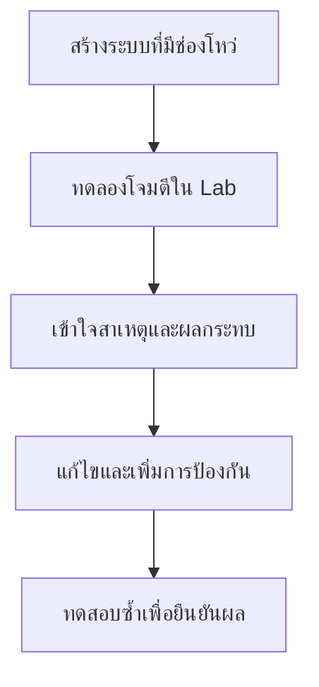

# Cyber Security: Attack, Understand & Defend

เรียนรู้ Cyber Security ผ่าน Lab ที่ทำตามได้จริง ตั้งแต่ทดลองโจมตี ทำความเข้าใจต้นเหตุ แก้ไขช่องโหว่ และทดสอบซ้ำว่าป้องกันได้ผล

> **Attack → Understand → Defend → Retest**

เหมาะสำหรับนักพัฒนา นักศึกษา วิศวกร และผู้เริ่มต้นที่อยากเข้าใจ Security จากการลงมือทำ

## วิธีเรียนในแต่ละ Lab



รายละเอียดการติดตั้ง ตัวอย่างการโจมตี และวิธีป้องกันจะแยกอยู่ใน `README.md` ของแต่ละ Lab

## เนื้อหาใน Playlist

| EP | หัวข้อ | หมวดหมู่ | สถานะ |
| --- | --- | --- | --- |
| EP01 | [Reverse Tabnabbing](./01-reverse-tabnabbing/) | Web | พร้อมใช้งาน |
| EP02 | Cross-Site Scripting (XSS) | Web | 📌 วางแผนไว้ |
| EP03 | Cross-Site Request Forgery (CSRF) | Web | 📌 วางแผนไว้ |
| EP04 | SQL Injection | Application | 📌 วางแผนไว้ |
| EP05 | IDOR / Broken Access Control | API | 📌 วางแผนไว้ |
| EP06 | Path Traversal | Application | 📌 วางแผนไว้ |
| EP07 | Command Injection | System | 📌 วางแผนไว้ |
| EP08 | Insecure File Upload | Web | 📌 วางแผนไว้ |
| EP09 | Session & Cookie Security | Web | 📌 วางแผนไว้ |
| EP10 | JWT Mistakes | API | 📌 วางแผนไว้ |
| EP11 | CORS Misconfiguration | Web / API | 📌 วางแผนไว้ |
| EP12 | API Rate Limiting | API | 📌 วางแผนไว้ |
| EP13 | MQTT Security | IoT | 📌 วางแผนไว้ |
| EP14 | Modbus TCP Security Lab | Industrial IoT | 📌 วางแผนไว้ |
| EP15 | IoT Device Security | Embedded / IoT | 📌 วางแผนไว้ |

## ระบบที่เราจะศึกษา

| ส่วนประกอบ | ประเด็นด้าน Security |
| --- | --- |
| ESP32 | Firmware และ Secrets |
| Wi-Fi | Network Exposure |
| MQTT | Anonymous Access และ ACL |
| FastAPI | Authentication, IDOR และ Injection |
| Database | SQL Injection และสิทธิ์การเข้าถึง |
| Frontend | XSS, CSRF และ Tabnabbing |
| Linux | Permission และ Service Exposure |

## เริ่มต้นใช้งาน

```bash
git clone https://github.com/KOPE-SOLUTION/cybersecurity-attack-understand-defend.git
cd cybersecurity-attack-understand-defend
```

จากนั้นเลือกโฟลเดอร์ Lab ที่ต้องการ และอ่าน `README.md` ภายในโฟลเดอร์นั้น

ตัวอย่าง:

```bash
cd 01-reverse-tabnabbing
```

## เทคโนโลยีที่ใช้

HTML, JavaScript, Python, FastAPI, Linux, Docker, MQTT, ESP32, Modbus และ Wireshark โดยแต่ละ Lab จะเลือกใช้เฉพาะเครื่องมือที่เกี่ยวข้อง

## ข้อควรระวัง

> [!WARNING]
> เนื้อหานี้มีไว้เพื่อการศึกษาและการทดสอบระบบที่ได้รับอนุญาตเท่านั้น

- ทดลองเฉพาะใน Lab, อุปกรณ์ หรือระบบที่คุณเป็นเจ้าของหรือได้รับอนุญาต
- ห้ามเปิดระบบที่ตั้งใจให้มีช่องโหว่สู่ Public Internet
- ใช้ข้อมูลและ Credential สมมติในการทดลอง
- สำหรับ Industrial Security ห้ามทดลองกับระบบ Production หรือระบบปฏิบัติการจริงของโรงงาน

## KOPE SOLUTION

**Cyber Security • IoT • Embedded Systems • Industrial IoT • Software Engineering**

> Build it. Break the lab. Understand it. Defend it.
